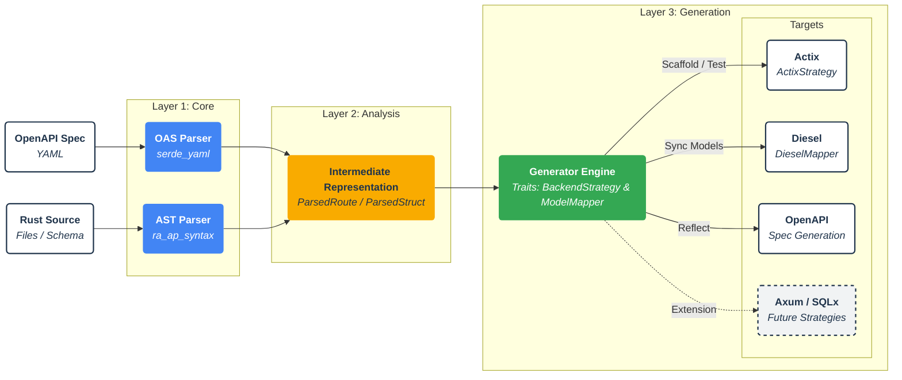

# cdd-rust Architecture

The internal architecture separates the core AST/OpenAPI parsing logic from the target code generation. This allows the
tool to support multiple web frameworks and ORMs through the `BackendStrategy` and `ModelMapper` traits.

The project is workspace-based to separate core logic from the command-line interface.

| Crate          | Purpose                                                                                                                                                                                    |
|----------------|--------------------------------------------------------------------------------------------------------------------------------------------------------------------------------------------|
| **`cdd-core`** | **The Engine.** Contains the `ra_ap_syntax` parsers, the OpenAPI 3.x parser (with 3.2 shims), AST diffing logic, and the Backend Strategy traits (currently implementing `ActixStrategy`). |
| **`cdd-cli`**  | **The Interface.** Provides the `sync`, `scaffold`, `schema-gen` and `test-gen` commands.                                                                                                  |
| **`cdd-web`**  | **The Reference.** An Actix+Diesel implementation demonstrating the generated code and tests in action.                                                                                    |

## Testing and Compliance

The codebase is strictly enforced to achieve **100% test coverage** and **100% documentation coverage** without relying on configuration bypasses (such as `tarpaulin.toml` exceptions or injected `#![allow(missing_docs)]` pragmas). Continuous Integration (CI) enforces these targets.
