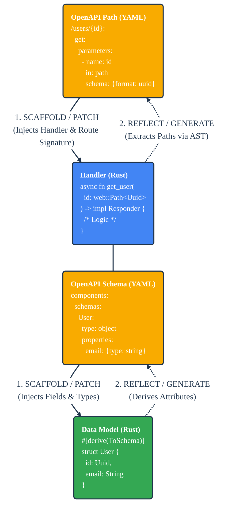
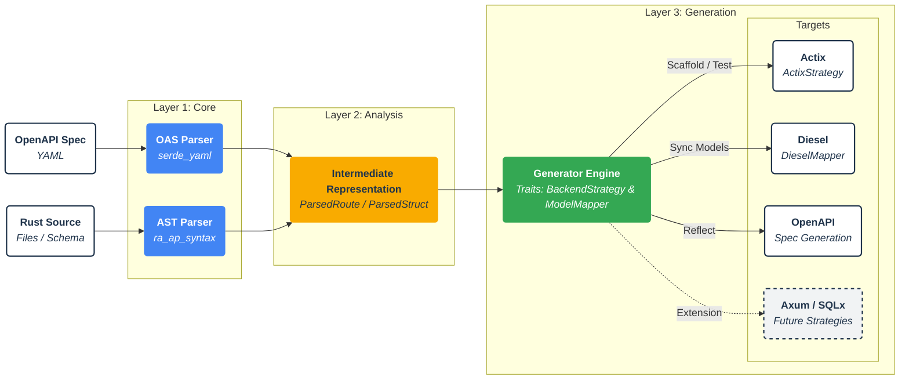

cdd-rust: OpenAPI ↔ Rust
========================
[](https://www.rust-lang.org)
[](LICENSE-APACHE)
[](https://github.com/offscale/cdd-rust/actions/workflows/ci-cargo.yml)

**cdd-rust** is a compiler-driven development toolchain designed to enable "Surgical" Compiler-Driven Development.

Unlike traditional generators that blindly overwrite files or dump code into "generated" folders, `cdd-rust` understands
the Abstract Syntax Tree (AST) of your Rust code. It uses `ra_ap_syntax` (the underlying parser of **rust-analyzer**) to
read, understand, and safely patch your existing source code to match your OpenAPI specifications (and vice-versa).

## ⚡️ Key Capabilities

### 1. Surgical Merging (OpenAPI ➔ Existing Rust)

The core engine features a non-destructive patcher (`cdd-core/patcher`) capable of merging OpenAPI definitions into an
existing codebase.

* **AST-Aware:** It preserves your comments, whitespace, and manual formatting.
* **Smart Routing:** It can parse your existing `actix_web` configuration functions and inject missing `.service()`
  calls without duplicating existing ones.
* **Type Safety:** OpenAPI types are strictly mapped to Rust constraints:
    * `format: uuid` ➔ `uuid::Uuid`
    * `format: date-time` ➔ `chrono::DateTime<Utc>`
    * `format: password` ➔ `Secret<String>`
* **Typed Queries:** Query parameters are generated as dedicated structs (with `serde` renames) and injected into
  handler signatures for strong typing.

### 2. Synchronization (Database ➔ Rust ➔ OpenAPI)

Keep your code as the single source of truth. The `sync` workflow ensures your Rust models match your Postgres database
and are ready for OpenAPI generation.

* **DB Inspection:** Uses `dsync` to generate strictly typed Diesel structs from the DB schema.
* **Attribute Injection:** Automatically parses generated structs to inject
  `#[derive(ToSchema, Serialize, Deserialize)]` and necessary imports, ensuring compatibility
  with [utoipa](https://github.com/juhaku/utoipa).

### 3. Contract Verification (OpenAPI ➔ Tests)

Generate strictly typed integration tests (`tests/api_contracts.rs`) that treat your application as a black box to
verify compliance with the spec.

* **Smart Mocking:** Automatically creates dummy values for Path, Query, and Body parameters based on strict type
  definitions.
* **Runtime Expression Resolution:** supports OAS 3.2 runtime expressions and embedded templates
  (e.g., `{$request.body#/id}` and `https://example.com?x={$request.path.id}`) for HATEOAS link validation.
* **Schema Validation:** Verifies that API responses strictly match the JSON Schema defined in your OpenAPI document
  using `jsonschema`.

## ⚡️ The CDD Loop



## 🏗 Architecture

The internal architecture separates the core AST/OpenAPI parsing logic from the target code generation. This allows the
tool to support multiple web frameworks and ORMs through the `BackendStrategy` and `ModelMapper` traits.



The project is workspace-based to separate core logic from the command-line interface.

| Crate          | Purpose                                                                                                                                                                                    |
|----------------|--------------------------------------------------------------------------------------------------------------------------------------------------------------------------------------------|
| **`cdd-core`** | **The Engine.** Contains the `ra_ap_syntax` parsers, the OpenAPI 3.x parser (with 3.2 shims), AST diffing logic, and the Backend Strategy traits (currently implementing `ActixStrategy`). |
| **`cdd-cli`**  | **The Interface.** Provides the `sync` and `test-gen` commands.                                                                                                                            |
| **`cdd-web`**  | **The Reference.** An Actix+Diesel implementation demonstrating the generated code and tests in action.                                                                                    |

## 📦 CLI Usage

### 1. Sync Pipeline (DB ➔ Models)

Synchronize Diesel models and inject OpenAPI attributes.

```bash
cargo run -p cdd-cli -- sync \
  --schema-path web/src/schema.rs \
  --model-dir web/src/models
```

This performs the following:

1. Reads `schema.rs`.
2. Generates rust structs in `models/` using `diesel/dsync` logic.
3. **Patches** the files to add `#![allow(missing_docs)]`, `use utoipa::ToSchema;`, and derive macros.

### 2. Test Generation (OpenAPI ➔ Tests)

Scaffold integration tests to verify your implementation meets the contract.

```bash
cargo run -p cdd-cli -- test-gen \
  --openapi-path docs/openapi.yaml \
  --output-path web/tests/api_contracts.rs \
  --app-factory crate::create_app
```

This generates a test file that:

1. Initializes your App factory.
2. Iterates through every route in your OpenAPI spec.
3. Sensibly mocks requests.
4. Validates that your Rust implementation returns the headers and bodies defined in the YAML.

### 3. Schema Generation (Rust ➔ OpenAPI)

Emit a minimal OpenAPI 3.2 document from a Rust struct/enum with optional `info` metadata.

```bash
cargo run -p cdd-cli -- schema-gen \
  --source-path web/src/models/user.rs \
  --name User \
  --openapi \
  --info-title "User API" \
  --info-version "1.0.0" \
  --info-summary "User service schema" \
  --info-terms-of-service "https://example.com/terms" \
  --info-contact-name "API Support" \
  --info-contact-email "support@example.com" \
  --info-license-name "Apache 2.0" \
  --info-license-identifier "Apache-2.0"
```

## 🛠 OpenAPI Compliance

`cdd-rust` features a highly compliant custom parser found in `core/src/oas`.

* **Versions:** Supports OpenAPI 3.0 and 3.1 directly.
* **Compatibility:** Implements shims for **OpenAPI 3.2**, specifically handling the `$self` keyword for Base URI
  determination (Appendix F) and downgrading version strings for library compatibility.
* **Validation:** Enforces required `info`, URI/email formatting for Info/Contact/License, leading-slash `paths`,
  unique `operationId` values, templated path conflicts, component key naming rules, response status code keys,
  security scheme definitions, security requirement resolution, non-empty `response.description` and `requestBody.content`,
  mutual exclusivity of `example` vs `examples` for parameters/headers, sequential-only use of `itemSchema`,
  and rejects `additionalOperations` that reuse reserved HTTP methods.
* **Resolution:** Local `$ref` resolution plus base-URI-aware absolute/relative self-references (no external fetch).
* **Relative Server URLs:** Resolves relative `servers.url` values (e.g., `.`, `./v1`, `v1`) into base paths with RFC3986 dot-segment normalization.
* **Polymorphism:** handles `oneOf`, `anyOf`, and `allOf` (flattening) into Rust Enums and Structs.
* **Discriminator Defaults:** supports `discriminator.defaultMapping` for OAS 3.2 polymorphic schemas.
* **Extractors:** Maps OAS parameters to backend-specific extractors (e.g., `web::Query`, `web::Path`, `web::Json`,
  `SecurityScheme`).
* **Media Types:** Recognizes vendor `+json` media types, `text/*`, and binary request bodies with dedicated extractors.
* **Media Type References:** Resolves `components.mediaTypes` `$ref` entries inside `content` (request bodies, responses, and headers).
* **Sequential Multipart:** supports `multipart/mixed` and `multipart/byteranges` `itemSchema` normalization.
* **Positional Encoding:** parses `prefixEncoding` / `itemEncoding` for multipart media types (OAS 3.2).
* **Examples:** Uses parameter `content` examples when generating contract tests, and supports
  `dataValue` / `serializedValue` / `externalValue` for request body examples (OAS 3.2).
* **Sequential Media Types:** Supports `itemSchema` for sequential JSON request bodies (e.g., `jsonl`, `ndjson`) and maps to `Vec<T>`.
* **Sequential Response Types:** Uses `itemSchema` for sequential media types (including `text/event-stream` and `multipart/*`) to infer `Vec<T>` when no `schema` is present.
* **Response Validation:** Contract tests validate JSON, vendor `+json`, sequential JSON, and `text/event-stream` responses.
* **Response Headers:** Resolves response header `$ref` and `content` definitions when extracting response metadata.
* **Reference Overrides:** Honors Reference Object `description` overrides for responses during validation and resolution.
* **Querystring:** Serializes `querystring` params
  as JSON when the media type is `application/json` (RFC3986-encoded).
* **Header/Cookie Params:** Contract tests serialize header/cookie parameters using OAS `style`/`explode` rules or `content` media types.
* **Header Validation:** Enforces Header Object constraints (`schema` vs `content`, `style: simple`, no `allowEmptyValue`), and ignores `Content-Type` headers.
* **Media Type Examples:** Validates `example` vs `examples` mutual exclusivity in request/response content.
* **Boolean Schemas:** Handles `schema: true/false` in request/response bodies (rejects required `false` bodies).
* **Style Validation:** Enforces type constraints for `deepObject`, `spaceDelimited`, and `pipeDelimited` parameter styles.
* **Schema ExternalDocs:** emits `externalDocs` metadata when generating OpenAPI schemas from Rust models.
* **Serde Mapping:** respects `rename_all` and `deny_unknown_fields` when generating OpenAPI schemas from Rust models.
* **Link Servers:** Applies Link Object `server` overrides (including defaulted variables) when generating HATEOAS link construction code.
* **Link Validation:** Resolves `operationRef` pointers to concrete path+method targets and errors on unknown `operationId` links.
* **Link Validation (Local Ref):** Errors when a local `operationRef` fails to resolve to a known operation.
* **Link Object Validation:** Enforces exactly one of `operationId` or `operationRef`, validates Link Object `server` definitions, enforces link name key patterns, and detects link `$ref` cycles.
* **Link Parsing:** Accepts normalized snake_case link keys (`operation_id`, `operation_ref`, `request_body`) during YAML preprocessing.
* **Contract Tests:** Skips webhook routes (inbound) during test generation.
* **Callbacks:** Enforces `operationId` uniqueness across callbacks and top-level operations.

## Developer Guide

### Prerequisites

* Rust (Nightly toolchain required for `ra_ap_syntax` compatibility feature flags in some contexts).
* PostgreSQL (if running the reference web implementation).

### Installation

```bash
git clone https://github.com/offscale/cdd-rust
cd cdd-rust
cargo build
```

### Running Tests

```bash
# Run unit tests
cargo test

# Run the generated contract tests (requires web/tests/api_contracts.rs to be generated)
cargo test -p cdd-web
```

## License

Licensed under either of Apache License, Version 2.0 or MIT license at your option.

--- 

## Developer guide

Install the latest version of [Rust](https://www.rust-lang.org). We tend to use nightly
versions. [CLI tool for installing Rust](https://rustup.rs).

We use [rust-clippy](https://github.com/rust-lang-nursery/rust-clippy) linters to improve code quality.

### Step-by-step guide

```bash
# Install Rust (nightly) 
$ curl --proto '=https' --tlsv1.2 -sSf https://sh.rustup.rs | sh -s -- --default-toolchain nightly
# Install cargo-make (cross-platform feature-rich reimplementation of Make) 
$ cargo install --force cargo-make
# Install rustfmt (Rust formatter) 
$ rustup component add rustfmt
# Clone this repo
$ git clone https://github.com/offscale/cdd-rust && cd cdd-rust
# Run tests
$ cargo test
# Format, build and test
$ cargo make
```

## License

Licensed under either of

- Apache License, Version 2.0 ([LICENSE-APACHE](LICENSE-APACHE) or <https://www.apache.org/licenses/LICENSE-2.0>)
- MIT license ([LICENSE-MIT](LICENSE-MIT) or <https://opensource.org/licenses/MIT>)

at your option.
