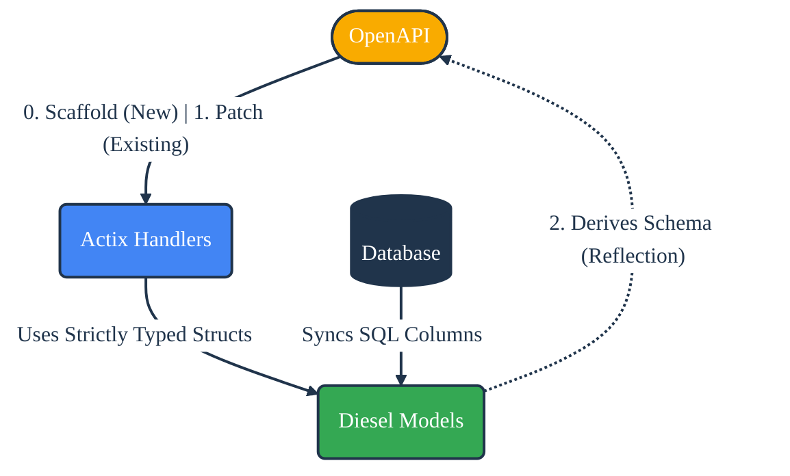

cdd-rust: OpenAPI ↔ Rust
========================
[](https://www.rust-lang.org)
[](LICENSE-APACHE)
[](https://github.com/offscale/cdd-rust/actions/workflows/ci-cargo.yml)

**Compiler Driven Development (CDD)** for Rust.

**cdd-rust** bridges the gap between your **Database**, **Rust Code**, and **OpenAPI Specifications**. Unlike traditional generators that produce untouchable code in a "generated" folder, `cdd-rust` uses advanced AST parsing to surgically patch your *existing* source files, strictly Typed handlers, and integration tests.

## ⚡️ The CDD Loop

Automate the repetitive parts of building robust web services with **Actix Web**, **Diesel**, and **Postgres**.



---

## 🚀 The Philosophy

**Compiler Driven Development** solves synchronization issues across language boundaries (Backend $\leftrightarrow$ Frontend $\leftrightarrow$ Docs).

*   **Single Source of Truth:** Your Code + Attributes *are* the documentation. Your Database *is* the source of your models.
*   **No Magic Folders:** We don't hide code. We generate code you can read, debug, and commit.
*   **Lossless Patching:** Powered by `ra_ap_syntax` (Rust Analyzer), we edit your files without breaking your manual formatting or comments.
*   **Contract Safety:** Automated updating of contract tests ensures your implementation strictly adheres to the API definition.

---

## 🛠 Features

### 1. Database & Model Sync (`sync`)
Keeps your Rust structs in perfect harmony with your Postgres schema.
*   **Diesel Integration:** Wraps `dsync` to generate raw structs from `schema.rs`.
*   **Attribute Injection:** Automatically parses generated structs and injects `utoipa::ToSchema`, `serde::Serialize`, and `serde::Deserialize`.
*   **Result:** A fully documented, OpenAPI-ready Rust struct generated directly from your DB.

### 2. Contract Test Generation (`test-gen`)
Treats your application as a black box to ensure spec compliance.
*   **Route Parsing:** Reads your `openapi.yaml`.
*   **Test Scaffolding:** Generates `tests/api_contracts.rs` containing `#[actix_web::test]` functions.
*   **Smart Mocking:** Automatically generates dummy values for `Uuid`, `Date`, and primitives to satisfy route parameters during testing.
*   **Schema Validation:** Includes logic to validate response bodies against the JSON Schema definitions.

### 3. AST-Based Patching (Core)
The engine under the hood (`cdd-core`) provides intelligent code manipulation:
*   **Smart Injection:** Adds fields to structs and lines to functions respecting indentation and comma placement.
*   **Structural Diffing:** configuration-aware diffing between target specs and actual implementations.
*   **Route Registration:** Injects `cfg.service(...)` calls into your Actix config without disrupting existing logic.

---

## 📦 Usage

### Installation

Clone the repository and build the CLI tool:

```bash
cargo build -p cdd-cli --release
```

### Command Reference

#### 1. Sync Pipeline (DB ➔ Rust ➔ OpenAPI)
Transforms raw Diesel schema files into rich, OpenAPI-compatible Rust structs.

```bash
# Workflow: 
# 1. Runs `dsync` to update models from schema.rs
# 2. Patches models with #[derive(ToSchema)]
cargo run -p cdd-cli -- sync \
  --schema-path web/src/schema.rs \
  --model-dir web/src/models
```

#### 2. Test Configuration (OpenAPI ➔ Tests)
Reads your API definition and writes a Rust test suite.

```bash
cargo run -p cdd-cli -- test-gen \
  --openapi-path docs/openapi.yaml \
  --output-path web/tests/api_contracts.rs \
  --app-factory crate::create_app
```

---

## 🏗 Project Structure

*   **`core/`**: The brain of the operation. Contains AST parsers (`ra_ap_syntax`), OpenAPI parsers, and code patching logic. It performs surgical updates on Rust source files.
*   **`cli/`**: The automation runner. Orchestrates `diesel`, `dsync`, and the core library to execute pipelines.
*   **`web/`**: The reference implementation. A standard Actix Web project that demonstrates how generated models and tests live alongside hand-written logic.

## 🎨 Design Principles

*   **Non-Destructive:** We respect your existing code style, comments, and spacing.
*   **Type Safety:** `Uuid`, `jso::serde::Value`, and `chrono::DateTime` are first-class citizens.
*   **Dependencies:**
    *   **Actix Web:** For the HTTP layer.
    *   **Diesel:** For ORM/DB layer.
    *   **Utoipa:** For OpenAPI attribute generation.
    *   **Ra_ap_syntax:** For 100% accurate code manipulation.

## 🔮 Roadmap

- [x] Structural Diffing & AST Patching
- [x] Database Model Synchronization
- [x] Contract Test Generation
- [x] Handler Scaffolding (Core Library Support)
- [ ] Visual Schema Designer Integration
- [ ] Expose Handler Scaffolding via CLI

---

## Developer guide

Install the latest version of [Rust](https://www.rust-lang.org). We tend to use nightly versions. [CLI tool for installing Rust](https://rustup.rs).

We use [rust-clippy](https://github.com/rust-lang-nursery/rust-clippy) linters to improve code quality.

There are plenty of [IDEs](https://areweideyet.com) and other [Rust development tools to consider](https://github.com/rust-unofficial/awesome-rust#development-tools).

### Step-by-step guide

```bash
# Install Rust (nightly)
$ curl --proto '=https' --tlsv1.2 -sSf https://sh.rustup.rs | sh -s -- --default-toolchain nightly
# Install cargo-make (cross-platform feature-rich reimplementation of Make)
$ cargo install --force cargo-make
# Install rustfmt (Rust formatter)
$ rustup component add rustfmt
# Clone this repo
$ git clone https://github.com/offscale/cdd-rust && cd cdd-rust
# Run tests
$ cargo test
# Format, build and test
$ cargo make
```

## License

Licensed under either of

- Apache License, Version 2.0 ([LICENSE-APACHE](LICENSE-APACHE) or <https://www.apache.org/licenses/LICENSE-2.0>)
- MIT license ([LICENSE-MIT](LICENSE-MIT) or <https://opensource.org/licenses/MIT>)

at your option.

### Contribution

Unless you explicitly state otherwise, any contribution intentionally submitted
for inclusion in the work by you, as defined in the Apache-2.0 license, shall be
dual licensed as above, without any additional terms or conditions.
