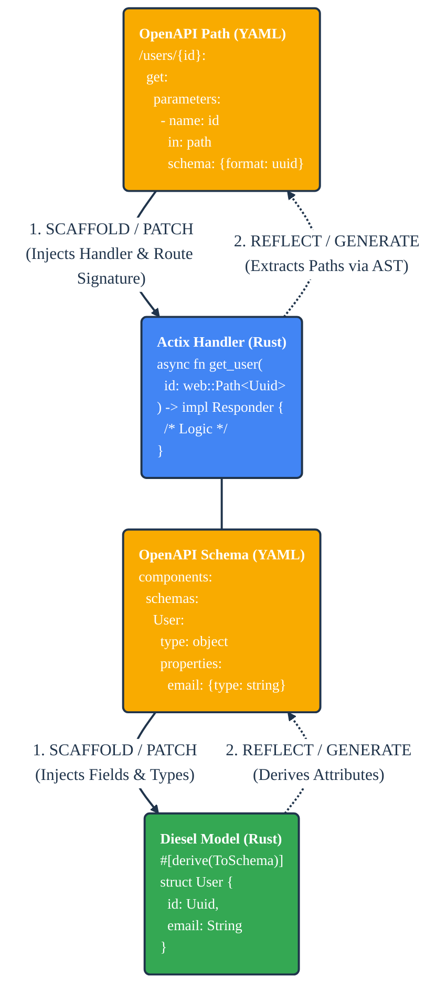

cdd-rust: OpenAPI ↔ Rust
========================
[](https://www.rust-lang.org)
[](LICENSE-APACHE)
[](https://github.com/offscale/cdd-rust/actions/workflows/ci-cargo.yml)

**Compiler Driven Development (CDD)** for Rust.

**cdd-rust** creates a symbiotic link between your **Database**, **Rust Code**, and **OpenAPI Specifications**. Unlike traditional generators that overwrite files or hide code in "generated" directories, `cdd-rust` uses advanced AST parsing (`ra_ap_syntax`) to surgically patch your *existing* source files, strictly typed handlers, and integration tests.

It supports two distinct workflows:
1.  **Scaffold | Patch (OpenAPI ➔ Rust):** Generate/update Actix handlers, routes, and Diesel models from OpenAPI.
2.  **Reflect & Sync (Rust ➔ OpenAPI):** Generate OpenAPI specifications from your actual source code.

## ⚡️ The CDD Loop



---

## 🚀 Features

### 1. Zero-Boilerplate Scaffolding (OpenAPI ➔ Rust)
Stop manually writing repetitive handler signatures. `cdd-rust` reads your spec and generates strictly typed code.
*   **Handler Scaffolding:** Transforms OpenAPI paths into `async fn` signatures with correct extractors:
    *   Path variables ➔ `web::Path<Uuid>`
    *   Query strings ➔ `web::Query<Value>`
    *   Request bodies ➔ `web::Json<T>`
*   **Route Registration:** Surgically injects `cfg.service(...)` calls into your `routes.rs` configuration using AST analysis, preserving existing logic.
*   **Non-Destructive Patching:** Uses [`ra_ap_syntax`](https://docs.rs/ra_ap_syntax/) (part of official [rust-lang/rust-analyzer](https://github.com/rust-lang/rust-analyzer)) to edit files safely. It respects your manual comments and formatting.

### 2. Source-of-Truth Reflection (Rust ➔ OpenAPI)
Keep your documentation alive. Your Rust code *is* the spec.
*   **Database Sync:** Wraps `dsync` to generate Rust structs directly from your Postgres `schema.rs`.
*   **Attribute Injection:** Automatically parses structs and injects `#[derive(ToSchema)]` and `#[serde(...)]` attributes.
*   **Type Mapping:** Maps Rust types (`Uuid`, `chrono::NaiveDateTime`) back to OpenAPI formats automatically.

### 3. Contract Safety (`test-gen`)
Ensure your implementation actually matches the spec.
*   **Test Generation:** Generates `tests/api_contracts.rs` based on your `openapi.yaml`.
*   **Smart Mocking:** Automatically fills request parameters with valid dummy data (e.g., UUIDs for ID fields, ISO strings for Dates).
*   **Validation:** Verifies that your API responses align with the JSON Schema defined in your spec.

---

## 📦 Command Usage

### 1. The Sync Pipeline
**DB ➔ Rust Models ➔ OpenAPI Attributes**
Synchronizes your database schema to your Rust structs and ensures they are ready for OpenAPI generation.

```bash
cargo run -p cdd-cli -- sync \
  --schema-path web/src/schema.rs \
  --model-dir web/src/models
```

### 2. The Test Pipeline
**OpenAPI ➔ Integration Tests**
Generates a test suite that treats your app as a black box.

```bash
cargo run -p cdd-cli -- test-gen \
  --openapi-path docs/openapi.yaml \
  --output-path web/tests/api_contracts.rs \
  --app-factory crate::create_app
```

---

## 🛠 Project Structure

*   **`core/`**: The engine. Contains AST parsers, OpenAPI parsers, and the diff/patch logic.
    *   `patcher.rs`: Surgical code editing.
    *   `handler_generator.rs`: Scaffolds Actix handlers.
    *   `oas.rs`: Parses OpenAPI YAML.
*   **`cli/`**: The workflow runner. Use this to run `sync` or `test-gen`.
*   **`web/`**: Reference implementation. An Actix Web + Diesel project demonstrating the generated code in action.

## 🎨 Design Principles

*   **No Magic Folders:** We generate code you can read, debug, and commit.
*   **Lossless Patching:** We edit your source files without breaking your style.
*   **Type Safety:** `Uuid`, `chrono`, and `rust_decimal` are first-class citizens.
*   **100% Coverage:** The toolchain itself enforces strict documentation and test coverage.

---

## Developer guide

Install the latest version of [Rust](https://www.rust-lang.org). We tend to use nightly versions. [CLI tool for installing Rust](https://rustup.rs).

We use [rust-clippy](https://github.com/rust-lang-nursery/rust-clippy) linters to improve code quality.

There are plenty of [IDEs](https://areweideyet.com) and other [Rust development tools to consider](https://github.com/rust-unofficial/awesome-rust#development-tools).

### Step-by-step guide

```bash
# Install Rust (nightly)
$ curl --proto '=https' --tlsv1.2 -sSf https://sh.rustup.rs | sh -s -- --default-toolchain nightly
# Install cargo-make (cross-platform feature-rich reimplementation of Make)
$ cargo install --force cargo-make
# Install rustfmt (Rust formatter)
$ rustup component add rustfmt
# Clone this repo
$ git clone https://github.com/offscale/cdd-rust && cd cdd-rust
# Run tests
$ cargo test
# Format, build and test
$ cargo make
```

## License

Licensed under either of

- Apache License, Version 2.0 ([LICENSE-APACHE](LICENSE-APACHE) or <https://www.apache.org/licenses/LICENSE-2.0>)
- MIT license ([LICENSE-MIT](LICENSE-MIT) or <https://opensource.org/licenses/MIT>)

at your option.

### Contribution

Unless you explicitly state otherwise, any contribution intentionally submitted
for inclusion in the work by you, as defined in the Apache-2.0 license, shall be
dual licensed as above, without any additional terms or conditions.
