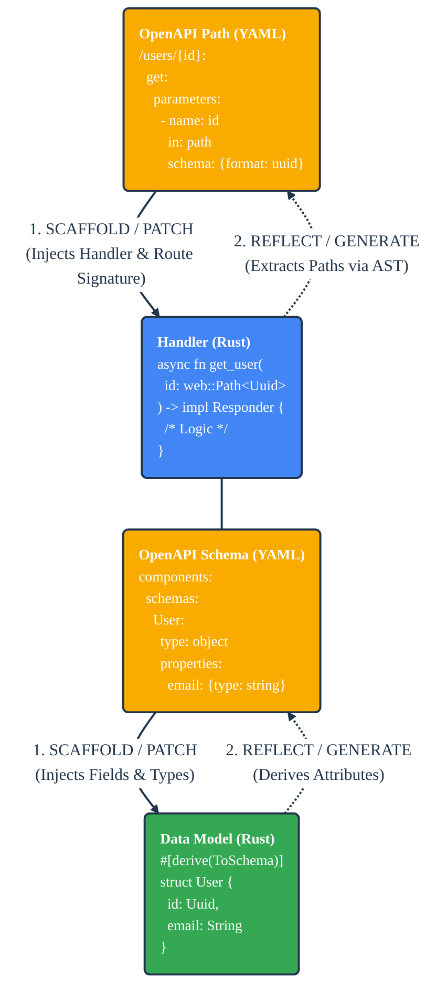

cdd-rust: OpenAPI ↔ Rust
========================

**cdd-rust** is a compiler-driven development toolchain designed to enable "Surgical" Compiler-Driven Development.

With **100% test and documentation coverage natively enforced** across the workspace, `cdd-rust` ensures rock-solid stability and strict OpenAPI 3.2.0 compliance without artificial exceptions.

Unlike traditional generators that blindly overwrite files or dump code into "generated" folders, `cdd-rust` understands
the Abstract Syntax Tree (AST) of your Rust code. It uses `ra_ap_syntax` (the underlying parser of **rust-analyzer**) to
read, understand, and safely patch your existing source code to match your OpenAPI specifications (and vice-versa).

## ⚡️ Key Capabilities

### 1. Surgical Merging (OpenAPI ➔ Existing Rust)

The core engine features a non-destructive patcher (`cdd-core/patcher`) capable of merging OpenAPI definitions into an
existing codebase.

* **AST-Aware:** It preserves your comments, whitespace, and manual formatting.
* **Smart Routing:** It can parse your existing `actix_web` configuration functions and inject missing `.service()`
  calls without duplicating existing ones.
* **Type Safety:** OpenAPI types are strictly mapped to Rust constraints:
    * `format: uuid` ➔ `uuid::Uuid`
    * `format: date-time` ➔ `chrono::DateTime<Utc>`
    * `format: password` ➔ `Secret<String>`
* **Typed Queries:** Query parameters are generated as dedicated structs (with `serde` renames) and injected into
  handler signatures for strong typing.

### 2. Synchronization (Database ➔ Rust ➔ OpenAPI)

Keep your code as the single source of truth. The `sync` workflow ensures your Rust models match your Postgres database
and are ready for OpenAPI generation.

* **DB Inspection:** Uses `dsync` to generate strictly typed Diesel structs from the DB schema.
* **Attribute Injection:** Automatically parses generated structs to inject
  `#[derive(ToSchema, Serialize, Deserialize)]` and necessary imports, ensuring compatibility
  with [utoipa](https://github.com/juhaku/utoipa).

### 3. Contract Verification (OpenAPI ➔ Tests)

Generate strictly typed integration tests (`tests/api_contracts.rs`) that treat your application as a black box to
verify compliance with the spec.

## Documentation

For more detailed information, please refer to the specific documentation files:

- [Architecture Guide](ARCHITECTURE.md) - Details on the internal layers and AST integration.
- [CLI Usage](USAGE.md) - How to run the `sync`, `scaffold`, `test-gen`, and `schema-gen` commands.
- [OpenAPI Compliance](COMPLIANCE.md) - **100% compliant** with OpenAPI 3.2.0. Details the implementation coverage.
- [Developer Guide](DEVELOPING.md) - Instructions for setting up the project locally.

## ⚡️ The CDD Loop

```mermaid
%%{init: { 
  'theme': 'base', 
  'themeVariables': { 
    'primaryColor': '#ffffff', 
    'primaryTextColor': '#20344b', 
    'primaryBorderColor': '#20344b', 
    'lineColor': '#20344b', 
    'fontFamily': 'Google Sans, sans-serif' 
  } 
}}%% 

graph TD
%% --- Section 1: Route Logic --- 

%% Node: OpenAPI Path
    OasPath("<strong>OpenAPI Path (YAML)</strong><br/>/users/{id}:<br/>&nbsp;&nbsp;get:<br/>&nbsp;&nbsp;&nbsp;&nbsp;parameters:<br/>&nbsp;&nbsp;&nbsp;&nbsp;&nbsp;&nbsp;- name: id<br/>&nbsp;&nbsp;&nbsp;&nbsp;&nbsp;&nbsp;&nbsp;&nbsp;in: path<br/>&nbsp;&nbsp;&nbsp;&nbsp;&nbsp;&nbsp;&nbsp;&nbsp;schema: {format: uuid}"):::yellow

%% Node: Actix Handler
    Actix("<strong>Handler (Rust)</strong><br/>async fn get_user(<br/>&nbsp;&nbsp;id: web::Path&lt;Uuid&gt;<br/>) -> impl Responder {<br/>&nbsp;&nbsp;/* Logic */<br/>}"):::blue

%% Flow: Down (Scaffold) & Up (Reflect) 
    OasPath ==>|"1. SCAFFOLD / PATCH<br/>(Injects Handler & Route Signature)"| Actix
    Actix -.->|"2. REFLECT / GENERATE<br/>(Extracts Paths via AST)"| OasPath

%% --- Spacer to force vertical layout --- 
    Actix ~~~ OasSchema

%% --- Section 2: Data Models --- 

%% Node: OpenAPI Schema
    OasSchema("<strong>OpenAPI Schema (YAML)</strong><br/>components:<br/>&nbsp;&nbsp;schemas:<br/>&nbsp;&nbsp;&nbsp;&nbsp;User:<br/>&nbsp;&nbsp;&nbsp;&nbsp;&nbsp;&nbsp;type: object<br/>&nbsp;&nbsp;&nbsp;&nbsp;&nbsp;&nbsp;properties:<br/>&nbsp;&nbsp;&nbsp;&nbsp;&nbsp;&nbsp;&nbsp;&nbsp;email: {type: string}"):::yellow

%% Node: Diesel Model
    Diesel("<strong>Data Model (Rust)</strong><br/>#[derive(ToSchema)]<br/>struct User {<br/>&nbsp;&nbsp;id: Uuid,<br/>&nbsp;&nbsp;email: String<br/>}"):::green

%% Flow: Down (Scaffold) & Up (Reflect) 
    OasSchema ==>|"1. SCAFFOLD / PATCH<br/>(Injects Fields & Types)"| Diesel
    Diesel -.->|"2. REFLECT / GENERATE<br/>(Derives Attributes)"| OasSchema

%% --- Styles --- 
    classDef yellow fill:#f9ab00,stroke:#20344b,stroke-width:2px,color:#ffffff,font-family:'Consolas',font-size:14px,text-align:left; 
    classDef blue fill:#4285f4,stroke:#20344b,stroke-width:2px,color:#ffffff,font-family:'Consolas',font-size:14px,text-align:left; 
    classDef green fill:#34a853,stroke:#20344b,stroke-width:2px,color:#ffffff,font-family:'Consolas',font-size:14px,text-align:left; 

    linkStyle default stroke:#20344b,stroke-width:2px; 
```

## License

Licensed under either of
- Apache License, Version 2.0 ([LICENSE-APACHE](LICENSE-APACHE) or <https://www.apache.org/licenses/LICENSE-2.0>)
- MIT license ([LICENSE-MIT](LICENSE-MIT) or <https://opensource.org/licenses/MIT>)
at your option.
