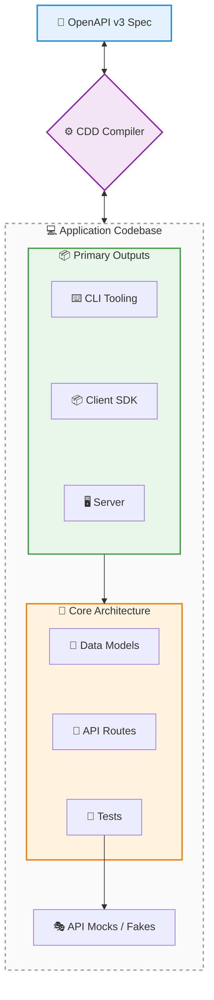

cdd-rust
============

[](https://opensource.org/licenses/Apache-2.0)
[](https://offscale.io/wasm_web_demo)
[](https://github.com/SamuelMarks/cdd-rust/actions)
[](#)
[](#)

**Compiler Driven Development (CDD)** is a development approach designed to eradicate the disconnect between: API specifications; server implementations; client SDKs; and command-line tooling.

Unlike traditional code generators—that treat outputs as disposable or read-only—CDD provides a **complete, standalone compiler** for each supported language. These compilers are fully CST-aware (Concreate Syntax Tree is a whitespace+comment aware Abstract Syntax Tree), allowing true bidirectional synchronization between existing hand-edited source code and OpenAPI specifications.

---

## 🏗️ The Standalone Compiler Architecture

Traditional tools use naïve templating—if you regenerate, your custom code is overwritten. 

The CDD ecosystem is fundamentally different. It utilizes language-specific, standalone compilers capable of full AST parsing, semantic diffing, and surgical patching.

**The Core Guarantee:** Every part of the generated codebase is fully editable. 
You are encouraged to open the generated routing files, model definitions, and CLI structures, and directly inject your business logic. 

- **When your specification changes**, the CDD compiler reads your code, builds an AST, diffs it against the new spec, and safely patches in new endpoints or fields without touching your custom logic.
- **When your codebase changes**, the compiler reverse-engineers your structural updates back into a 100% accurate, authoritative OpenAPI specification.

---

## 🔄 The Bidirectional Synchronization Loop


```mermaid
flowchart TD
    OAS["📄 OpenAPI v3 Spec"] <--> CDD{"⚙️ CDD Compiler"}
    
    CDD <--> Codebase
    
    subgraph Codebase ["💻 Application Codebase"]
        direction TB
        
        subgraph Outputs ["📦 Primary Outputs"]
            direction TB
            CLI["⌨️ CLI Tooling"]
            SDK["📦 Client SDK"]
            Server["🖥️ Server"]
            
            %% Force vertical stacking inside the subgraph
            CLI ~~~ SDK ~~~ Server
        end
        
        subgraph Core ["🔗 Core Architecture"]
            direction TB
            Models["🔗 Data Models"]
            Routes["🔀 API Routes"]
            Tests["🧪 Tests"]
            
            %% Force vertical stacking inside the subgraph
            Models ~~~ Routes ~~~ Tests
        end
        
        Mocks["🎭 API Mocks / Fakes"]

        %% Simple dependency flow down the page
        Outputs --> Core
        Tests --> Mocks
    end
    
    style OAS fill:#e3f2fd,stroke:#1e88e5,stroke-width:2px
    style CDD fill:#f3e5f5,stroke:#8e24aa,stroke-width:2px
    style Codebase fill:#fafafa,stroke:#9e9e9e,stroke-width:2px,stroke-dasharray: 5 5
    style Outputs fill:#e8f5e9,stroke:#43a047,stroke-width:2px
    style Core fill:#fff3e0,stroke:#f57c00,stroke-width:2px
```

The CDD lifecycle supports continuous evolution from any starting point:
1. **Generate**: Scaffold servers, SDKs, or CLIs from a central specification.
2. **Edit**: Developers write real, unconstrained code directly in the generated files.
3. **Extract**: Reverse-compile the edited code to produce an updated OpenAPI spec.
4. **Sync**: Apply new specification changes seamlessly into the existing, hand-edited codebase.

---

## 🌐 The Global Language Ecosystem

Every supported language operates on the same core CDD philosophies but is powered by a dedicated, native compiler tailored to that language's specific AST, idioms, and package management.

All implementations share a standardized CLI interface (`cdd [subcommand]`), acting as a universal toolchain.

| Repository | Language | Client; Client CLI; Server | Extra features | Standards | CI Status |
|---|---|---|---|---|---|
| [`cdd-c`](https://github.com/SamuelMarks/cdd-c) | C (C89) | Client; Client CLI; Server | FFI | Swagger 2.0 & OpenAPI 3.2.0 | [](https://github.com/SamuelMarks/cdd-c/actions/workflows/ci.yml) |
| [`cdd-cpp`](https://github.com/SamuelMarks/cdd-cpp) | C++ | Client; Client CLI; Server | Upgrades Swagger & Google Discovery to OpenAPI 3.2.0 | Google Discovery; Swagger 2.0 & OpenAPI 3.2.0 | [](https://github.com/SamuelMarks/cdd-cpp/actions/workflows/ci.yml) |
| [`cdd-csharp`](https://github.com/SamuelMarks/cdd-csharp) | C# | Client; Client CLI; Server | CLR | Swagger 2.0 & OpenAPI 3.2.0 | [](https://github.com/SamuelMarks/cdd-csharp/actions/workflows/ci.yml) |
| [`cdd-go`](https://github.com/SamuelMarks/cdd-go) | Go | Client; Client CLI; Server | | Swagger 2.0 & OpenAPI 3.2.0 | [](https://github.com/SamuelMarks/cdd-go/actions/workflows/ci.yml) |
| [`cdd-java`](https://github.com/SamuelMarks/cdd-java) | Java | Client; Client CLI; Server | | Swagger 2.0 & OpenAPI 3.2.0 | [](https://github.com/SamuelMarks/cdd-java/actions/workflows/ci.yml) |
| [`cdd-kotlin`](https://github.com/offscale/cdd-kotlin) | Kotlin (ktor for Multiplatform) | Client; Client CLI; Server | Auto-Admin UI | Swagger 2.0 & OpenAPI 3.2.0 | [](https://github.com/offscale/cdd-kotlin/actions/workflows/ci.yml) |
| [`cdd-php`](https://github.com/SamuelMarks/cdd-php) | PHP | Client; Client CLI; Server | | Swagger 2.0 & OpenAPI 3.2.0 | [](https://github.com/SamuelMarks/cdd-php/actions/workflows/ci.yml) |
| [`cdd-python`](https://github.com/offscale/cdd-python) | Python | N/A (server building blocks) | CLI ↔ SQL ↔ Pydantic ↔ docs ↔ JSON-schema | N/A | [](https://github.com/offscale/cdd-python/actions) |
| [`cdd-python-all`](https://github.com/offscale/cdd-python-all) | Python | Client; Client CLI; Server |  | Swagger 2.0 & OpenAPI 3.2.0 | [](https://github.com/offscale/cdd-python-all/actions/workflows/ci.yml) |
| [`cdd-ruby`](https://github.com/SamuelMarks/cdd-ruby) | Ruby | Client; Client CLI; Server |  | Swagger 2.0 & OpenAPI 3.2.0 | [](https://github.com/SamuelMarks/cdd-ruby/actions/workflows/ci.yml) |
| [`cdd-rust`](https://github.com/SamuelMarks/cdd-rust) | Rust | Client; Client CLI; Server |  | Swagger 2.0 & OpenAPI 3.2.0 | [](https://github.com/offscale/cdd-rust/actions/workflows/ci.yml) |
| [`cdd-sh`](https://github.com/SamuelMarks/cdd-sh) | Shell (/bin/sh) | Client; Client CLI; Server |  | Swagger 2.0 & OpenAPI 3.2.0 | [](https://github.com/SamuelMarks/cdd-sh/actions/workflows/ci.yml) |
| [`cdd-swift`](https://github.com/SamuelMarks/cdd-swift) | Swift | Client; Client CLI; Server |  | Swagger 2.0 & OpenAPI 3.2.0 | [](https://github.com/SamuelMarks/cdd-swift/actions/workflows/ci.yml) |
| [`cdd-ts`](https://github.com/offscale/cdd-ts) | TypeScript | Client; Client CLI; Server | Auto-Admin UI; Angular; React; Vue; fetch; Axios; Node.js | Swagger 2.0 & OpenAPI 3.2.0 | [](https://github.com/offscale/cdd-ts/actions/workflows/ci.yml) |

---

## 🛠️ Universal CLI Toolchain

A true ecosystem requires standardized tooling. Once a developer learns the CDD toolchain, they can synchronize architecture across the entire polyglot stack.

### Global Arguments

- `--help`: Print help information.
- `--version`: Print version information.
- `--input, -i` (or `-f`): Target file, directory, or OpenAPI spec.
- `--output, -o`: Destination path for generation or sync.

### Core Subcommands

#### `sync`
```console
Synchronize an OpenAPI specification with source code

Usage: cdd-rust sync [OPTIONS]

Options:
      --truth <TRUTH>
          The source of truth for the synchronization

          Possible values:
          - database: Synchronize from Database schema (dsync to models)
          - openapi:  Synchronize from OpenAPI spec to models (and potentially back to DB)
          - class:    Synchronize from Rust classes (models) to OpenAPI/DB
          
          [default: database]

  -i, --input <INPUT>
          Path to the Diesel schema file (e.g. web/src/schema.rs)
          
          [env: CDD_INPUT=]
          [default: web/src/schema.rs]

  -o, --output <OUTPUT>
          Output directory for generated models (e.g. web/src/models)
          
          [env: CDD_OUTPUT=]
          [default: web/src/models]

      --no-gen
          Skip the dsync generation step (only process existing files)

      --force-type <FORCE_TYPE>
          Enforce specific types for fields matching a name. Format: `"field_name=RustType"`. Example:
          `"--force-type created_at=chrono::DateTime<Utc>"`

  -t, --target <TARGET>
          Target mode (server or client)

          Possible values:
          - server-actix:    Actix Web Server
          - server-axum:     Axum Server
          - client-reqwest:  Reqwest Client
          - client-internal: Internal
          
          [env: CDD_TARGET=]
          [default: server-actix]

  -h, --help
          Print help (see a summary with '-h')
```

#### `test-gen`
```console
Generate integration tests based on OpenAPI contracts

Usage: cdd-rust test-gen [OPTIONS]

Options:
  -i, --openapi-path <OPENAPI_PATH>
          Path to the OpenAPI spec
          
          [env: CDD_INPUT=]
          [default: docs/openapi.yaml]

  -o, --output-path <OUTPUT_PATH>
          Output path for the test file
          
          [env: CDD_OUTPUT=]
          [default: tests/api_contracts.rs]

      --app-factory <APP_FACTORY>
          The function that initializes the Actix App (e.g. `web::create_app`). The generated code calls
          it as: `test::init_service({factory}(App::new()))`
          
          [default: crate::http::routes::config]

  -t, --target <TARGET>
          Target mode (server or client)

          Possible values:
          - server-actix:    Actix Web Server
          - server-axum:     Axum Server
          - client-reqwest:  Reqwest Client
          - client-internal: Internal
          
          [env: CDD_TARGET=]
          [default: server-actix]

  -h, --help
          Print help (see a summary with '-h')
```

#### `scaffold`
```console
Scaffold handler functions from OpenAPI Routes

Usage: cdd-rust scaffold [OPTIONS]

Options:
  -i, --openapi-path <OPENAPI_PATH>
          Path to the OpenAPI spec
          
          [env: CDD_INPUT=]
          [default: docs/openapi.yaml]

  -o, --output-dir <OUTPUT_DIR>
          Output directory for handler modules (e.g., `web/src/http/handlers`)
          
          [env: CDD_OUTPUT=]
          [default: web/src/http/handlers]

      --route-config-path <ROUTE_CONFIG_PATH>
          Path to the file containing the route configuration function. If provided, routes will be
          injected into `pub fn config(cfg: &mut web::ServiceConfig)`. Example: `web/src/lib.rs` or
          `web/src/http/routes.rs`

      --force
          Whether to force overwrite existing files (by default, it patches them). Note: The patcher is
          non-destructive by default

  -t, --target <TARGET>
          Target mode (server or client)

          Possible values:
          - server-actix:    Actix Web Server
          - server-axum:     Axum Server
          - client-reqwest:  Reqwest Client
          - client-internal: Internal
          
          [env: CDD_TARGET=]
          [default: server-actix]

  -h, --help
          Print help (see a summary with '-h')
```

#### `schema-gen`
```console
Generate a JSON Schema from a Rust struct or enum

Usage: cdd-rust schema-gen [OPTIONS] --source-path <SOURCE_PATH> --name <NAME>

Options:
  -i, --source-path <SOURCE_PATH>
          Path to the Rust source file containing the model
          
          [env: CDD_INPUT=]

      --name <NAME>
          Name of the Struct or Enum to generate schema for

  -o, --output <OUTPUT>
          Output path for the schema file. Supports .json and .yaml/.yml extensions. If not provided,
          prints JSON to stdout
          
          [env: CDD_OUTPUT=]

      --dialect <DIALECT>
          Optional JSON Schema Dialect URI to include in $schema. Example:
          `"https://json-schema.org/draft/2020-12/schema"`

      --openapi
          Emit a minimal OpenAPI 3.2 document instead of a standalone JSON Schema

      --info-title <INFO_TITLE>
          Optional OpenAPI info.title override (defaults to the model name)

      --info-version <INFO_VERSION>
          Optional OpenAPI info.version override (defaults to "1.0.0")

      --info-description <INFO_DESCRIPTION>
          Optional OpenAPI info.description override

      --info-summary <INFO_SUMMARY>
          Optional OpenAPI info.summary override

      --info-terms-of-service <INFO_TERMS_OF_SERVICE>
          Optional OpenAPI info.termsOfService override

  -t, --target <TARGET>
          Target mode (server or client)

          Possible values:
          - server-actix:    Actix Web Server
          - server-axum:     Axum Server
          - client-reqwest:  Reqwest Client
          - client-internal: Internal
          
          [env: CDD_TARGET=]
          [default: server-actix]

      --info-contact-name <INFO_CONTACT_NAME>
          Optional OpenAPI info.contact.name override

      --info-contact-url <INFO_CONTACT_URL>
          Optional OpenAPI info.contact.url override

      --info-contact-email <INFO_CONTACT_EMAIL>
          Optional OpenAPI info.contact.email override

      --info-license-name <INFO_LICENSE_NAME>
          Optional OpenAPI info.license.name override

      --info-license-url <INFO_LICENSE_URL>
          Optional OpenAPI info.license.url override

      --info-license-identifier <INFO_LICENSE_IDENTIFIER>
          Optional OpenAPI info.license.identifier override

      --self-uri <SELF_URI>
          Optional OpenAPI `$self` URI for the document base

  -h, --help
          Print help (see a summary with '-h')
```

#### `to_docs_json`
```console
Generate JSON documentation with code snippets for an OpenAPI specification

Usage: cdd-rust to_docs_json [OPTIONS] --input <INPUT>

Options:
  -i, --input <INPUT>
          Path or URL to the OpenAPI specification
          
          [env: CDD_INPUT=]

      --no-imports
          If provided, omit the imports field in the code object
          
          [env: CDD_NO_IMPORTS=]

      --no-wrapping
          If provided, omit the wrapper_start and wrapper_end fields in the code object
          
          [env: CDD_NO_WRAPPING=]

  -o, --output <OUTPUT>
          Output file or directory path
          
          [env: CDD_OUTPUT=]

  -t, --target <TARGET>
          Target mode (server or client)

          Possible values:
          - server-actix:    Actix Web Server
          - server-axum:     Axum Server
          - client-reqwest:  Reqwest Client
          - client-internal: Internal
          
          [env: CDD_TARGET=]
          [default: server-actix]

  -h, --help
          Print help (see a summary with '-h')
```

#### `from_openapi`
```console
Generate code from an OpenAPI specification

Usage: cdd-rust from_openapi [OPTIONS] <COMMAND>

Commands:
  to_sdk_cli  Generate a CLI SDK
  to_sdk      Generate a Client SDK
  to_server   Generate Server scaffolding
  help        Print this message or the help of the given subcommand(s)

Options:
  -t, --target <TARGET>
          Target mode (server or client)

          Possible values:
          - server-actix:    Actix Web Server
          - server-axum:     Axum Server
          - client-reqwest:  Reqwest Client
          - client-internal: Internal
          
          [env: CDD_TARGET=]
          [default: server-actix]

  -h, --help
          Print help (see a summary with '-h')
```

#### `from_openapi to_sdk_cli`
```console
Generate a CLI SDK

Usage: cdd-rust from_openapi to_sdk_cli [OPTIONS]

Options:
  -i, --input <INPUT>
          Path or URL to the OpenAPI specification
          
          [env: CDD_INPUT=]

      --input-dir <INPUT_DIR>
          Directory containing OpenAPI specifications
          
          [env: CDD_INPUT_DIR=]

  -o, --output <OUTPUT_DIR>
          Output file or directory path
          
          [env: CDD_OUTPUT=]

      --no-github-actions
          Do not generate GitHub Actions scaffolding
          
          [env: CDD_NO_GITHUB_ACTIONS=]

      --no-installable-package
          Do not generate installable package scaffolding
          
          [env: CDD_NO_INSTALLABLE_PACKAGE=]

      --tests
          Generate integration tests and mocks
          
          [env: CDD_TESTS=]

      --mcp
          Generate Model Context Protocol (MCP) server and adapter
          
          [env: CDD_MCP=]

  -t, --target <TARGET>
          Target mode (server or client)

          Possible values:
          - server-actix:    Actix Web Server
          - server-axum:     Axum Server
          - client-reqwest:  Reqwest Client
          - client-internal: Internal
          
          [env: CDD_TARGET=]
          [default: server-actix]

  -h, --help
          Print help (see a summary with '-h')
```

#### `from_openapi to_sdk`
```console
Generate a Client SDK

Usage: cdd-rust from_openapi to_sdk [OPTIONS]

Options:
  -i, --input <INPUT>
          Path or URL to the OpenAPI specification
          
          [env: CDD_INPUT=]

      --input-dir <INPUT_DIR>
          Directory containing OpenAPI specifications
          
          [env: CDD_INPUT_DIR=]

  -o, --output <OUTPUT_DIR>
          Output file or directory path
          
          [env: CDD_OUTPUT=]

      --no-github-actions
          Do not generate GitHub Actions scaffolding
          
          [env: CDD_NO_GITHUB_ACTIONS=]

      --no-installable-package
          Do not generate installable package scaffolding
          
          [env: CDD_NO_INSTALLABLE_PACKAGE=]

      --tests
          Generate integration tests and mocks
          
          [env: CDD_TESTS=]

      --mcp
          Generate Model Context Protocol (MCP) server and adapter
          
          [env: CDD_MCP=]

  -t, --target <TARGET>
          Target mode (server or client)

          Possible values:
          - server-actix:    Actix Web Server
          - server-axum:     Axum Server
          - client-reqwest:  Reqwest Client
          - client-internal: Internal
          
          [env: CDD_TARGET=]
          [default: server-actix]

  -h, --help
          Print help (see a summary with '-h')
```


#### `from_openapi to_server`
```console
Generate Server scaffolding

Usage: cdd-rust from_openapi to_server [OPTIONS]

Options:
  -i, --input <INPUT>
          Path or URL to the OpenAPI specification
          
          [env: CDD_INPUT=]

      --input-dir <INPUT_DIR>
          Directory containing OpenAPI specifications
          
          [env: CDD_INPUT_DIR=]

  -o, --output <OUTPUT_DIR>
          Output file or directory path
          
          [env: CDD_OUTPUT=]

      --no-github-actions
          Do not generate GitHub Actions scaffolding
          
          [env: CDD_NO_GITHUB_ACTIONS=]

      --no-installable-package
          Do not generate installable package scaffolding
          
          [env: CDD_NO_INSTALLABLE_PACKAGE=]

      --tests
          Generate integration tests and mocks
          
          [env: CDD_TESTS=]

      --mcp
          Generate Model Context Protocol (MCP) server and adapter
          
          [env: CDD_MCP=]

      --framework <FRAMEWORK>
          The target server framework (actix-web or axum). Defaults to actix-web

          Possible values:
          - actix-web: Actix Web framework
          - axum:      Axum framework
          
          [env: CDD_SERVER_FRAMEWORK=]
          [default: actix-web]

  -t, --target <TARGET>
          Target mode (server or client)

          Possible values:
          - server-actix:    Actix Web Server
          - server-axum:     Axum Server
          - client-reqwest:  Reqwest Client
          - client-internal: Internal
          
          [env: CDD_TARGET=]
          [default: server-actix]

  -h, --help
          Print help (see a summary with '-h')
```

#### `to_openapi`
```console
Generate an OpenAPI specification from source code

Usage: cdd-rust to_openapi [OPTIONS] --input <INPUT>

Options:
  -i, --input <INPUT>
          Path to source code directory or file
          
          [env: CDD_INPUT=]

  -o, --output <OUTPUT>
          Output file or directory path
          
          [env: CDD_OUTPUT=]
          [default: spec.json]

  -t, --target <TARGET>
          Target mode (server or client)

          Possible values:
          - server-actix:    Actix Web Server
          - server-axum:     Axum Server
          - client-reqwest:  Reqwest Client
          - client-internal: Internal
          
          [env: CDD_TARGET=]
          [default: server-actix]

  -h, --help
          Print help (see a summary with '-h')
```

#### `serve_json_rpc`
```console
Expose CLI interface as a JSON-RPC server

Usage: cdd-rust serve_json_rpc [OPTIONS]

Options:
  -p, --port <PORT>
          Port to listen on. The port to listen on
          
          [env: CDD_PORT=]
          [default: 8080]

  -l, --listen <LISTEN>
          Interface to listen on. The address to listen on
          
          [env: CDD_LISTEN=]
          [default: 127.0.0.1]

  -t, --target <TARGET>
          Target mode (server or client)

          Possible values:
          - server-actix:    Actix Web Server
          - server-axum:     Axum Server
          - client-reqwest:  Reqwest Client
          - client-internal: Internal
          
          [env: CDD_TARGET=]
          [default: server-actix]

  -h, --help
          Print help (see a summary with '-h')
```

#### `mcp`
```console
Run the generator as an MCP server over stdio

Usage: cdd-rust mcp [OPTIONS]

Options:
  -t, --target <TARGET>
          Target mode (server or client)

          Possible values:
          - server-actix:    Actix Web Server
          - server-axum:     Axum Server
          - client-reqwest:  Reqwest Client
          - client-internal: Internal
          
          [env: CDD_TARGET=]
          [default: server-actix]

  -h, --help
          Print help (see a summary with '-h')
```


### Detail Features Beyond Common Subset

- **Target modes:** Can generate code for Actix Web Server (`server-actix`), Axum Server (`server-axum`), Reqwest Client (`client-reqwest`), and an internal target (`client-internal`).
- **Database synchronization:** Supports synchronizing DB schema to Rust models and OpenAPI-ready structs.
- **Test generation:** Generates integration tests based on OpenAPI contracts.
- **Handler scaffolding:** Scaffolds handler functions from OpenAPI Routes.
- **Schema generation:** Generates a JSON Schema from a Rust struct or enum.

---

## 🚀 The End of "Spec Drift"

With Compiler Driven Development, specifications and code are no longer loosely coupled artifacts. They are strict, isomorphic reflections of one another, maintained by dedicated standalone compilers. 

Choose your language ecosystem above and start treating your architecture as a seamlessly compiled, endlessly editable whole.

---

## License

Licensed under either of

- Apache License, Version 2.0 ([LICENSE-APACHE](LICENSE-APACHE) or <https://www.apache.org/licenses/LICENSE-2.0>)
- MIT license ([LICENSE-MIT](LICENSE-MIT) or <https://opensource.org/licenses/MIT>)

at your option.

### Contribution

Unless you explicitly state otherwise, any contribution intentionally submitted
for inclusion in the work by you, as defined in the Apache-2.0 license, shall be
dual licensed as above, without any additional terms or conditions.
